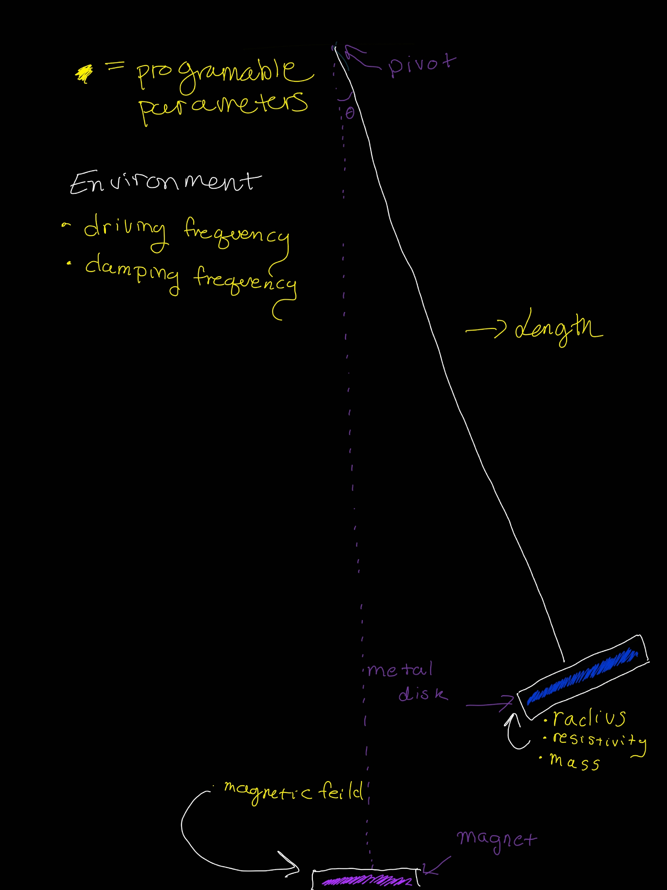

# Compound Pendulum

A program that allows the user to define the parameters of a pendulum and run a simulation of it's behavior

* Mass of disk
* Resistivity of disk
* Radius of disk
* Mass of pendulum arm
* Length of pendulum arm
* Driving frequency 
* Dampening frequency
* Time (steps 0.01)
* Magnet strength
* Time step length
* Simulation duration

